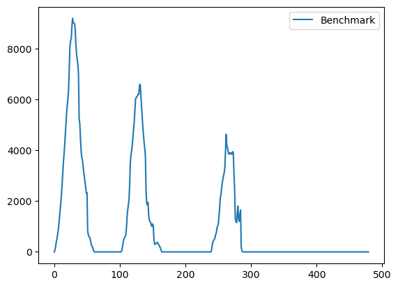
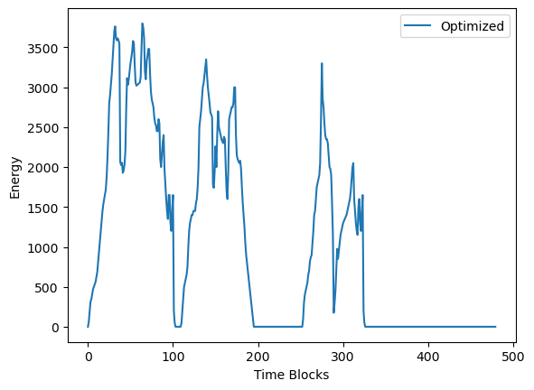

# Energy Minimizer

## Overview
A prototype tool used to determine the best production schedule that minimizes energy usage 

## Features
- Integer Programming with Simulated Annealing to minimize energy usage

## Tech Stack
- Simulated Annealing

## How to Run
- Update data/Production Plan.csv to reflect Production Plan to optimize
- Update data/Product Energy Demand.csv if there are any updates or new products
- Run all in main.ipynb

## Example Use Case

Users can input production energy demand, and initial production schedule and run the script to generate an optimized production schedule.

## Results / Screenshots

Here is the sample result before optimization

Here is the actual result post optimization

As visualized, post optimization the maximum energy demand reduced from approximately 9000 energy units to 3500 energy units a reduction of approximately 60%.

Do note however this strategy has trade-off of extending production time due to staggering of production.

## Future Improvements
- Improve process flow
- Convert to app for better User Experience 

## Lessons Learned
- Application of Integer Programming, Simulated Annealing
